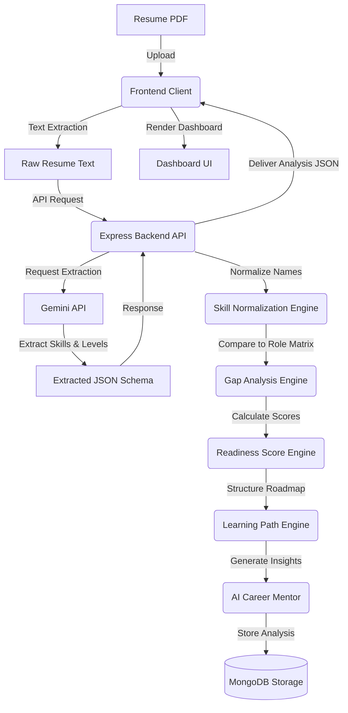

# CareerLens

> **Analyze. Focus. Grow.**

CareerLens is a smart education platform designed to bridge the gap between academic preparation and industry expectations. Students often struggle to understand whether their current skills align with the rigorous requirements of target career roles. CareerLens solves this by allowing students to upload their resumes, select a target role, identify skill gaps, evaluate career readiness, receive a structured personalized learning path, and get AI-powered career mentorship.

---

## Table of Contents

1. [Project Overview](#project-overview)
2. [Tech Stack](#tech-stack)
3. [System Architecture](#system-architecture)
4. [AI Responsibilities & Boundaries](#ai-responsibilities--boundaries)
5. [Route Structure](#route-structure)
6. [Data Architecture](#data-architecture)
   - [Frontend Data Files](#frontend-data-files)
   - [Dashboard Data Structure](#dashboard-data-structure)
7. [Proficiency System](#proficiency-system)
8. [Current Implementation Status](#current-implementation-status)
9. [Important Design Principles](#important-design-principles)
10. [Upcoming Development Phases](#upcoming-development-phases)
11. [Getting Started (Local Development)](#getting-started-local-development)

---

## Project Overview

- **Domain:** Smart Education
- **Problem Statement:** Students lack direct visibility into how their current skills match up against real-world job requirements, leading to unfocused learning and preparation mismatch.
- **Solution:** CareerLens provides a comprehensive, deterministic gap analysis by parsing resumes, matching them against industry-standard role matrices, generating structured learning roadmaps, and providing supplementary AI guidance.

---

## Tech Stack

| Layer | Technology | Status / Details |
| :--- | :--- | :--- |
| **Frontend Core** | React (Vite) | Main client application, fast builds |
| **Styling** | Tailwind CSS | Utility-first responsive styling |
| **Routing** | React Router DOM | Client-side routing with protected routes |
| **Icons** | Lucide React | Clean, modern vector icons |
| **Animations** | Framer Motion | Smooth state transitions and progress animations |
| **Backend (Planned)** | Node.js, Express.js | Core API, orchestrating calculations and storage |
| **Database (Planned)**| MongoDB | Persisting user profiles and analysis results |
| **Authentication** | JWT Authentication | Stateless session management |
| **AI Integration** | Gemini API | Powered by Google Gemini for content parsing & mentorship |

---

## System Architecture

The upcoming backend integration follows a structured pipeline where the AI behaves as an information extractor, while the backend coordinates the heavy business logic to ensure calculations remain deterministic and fast.



### Detailed Pipeline Flow
1. **Resume Processing:** The client extracts text from the uploaded PDF to minimize payload sizes and prevent backend document-parsing overhead.
2. **AI Skill Extraction:** Raw text is passed to the Gemini API with structured prompt schemas. Gemini extracts technical/soft skills and estimates the student's proficiency level.
3. **Skill Normalization:** The backend matches extracted skill names against a unified directory to avoid syntax discrepancies (e.g., matching "JS" or "ES6" to "JavaScript").
4. **Gap Analysis & Scoring:** The core backend business logic compares the normalized skills against the target role's master matrix, calculating readiness scores and defining missing skills.
5. **Learning & Mentor Generation:** The backend pulls matching resources for the missing skills and queries the AI Career Mentor for contextual insights before returning the finalized data payload and saving it to MongoDB.

---

## AI Responsibilities & Boundaries

To ensure predictability, security, and scalability, CareerLens maintains a strict boundary between AI capabilities and backend business logic.

```
┌───────────────────────────────────────┐
│           AI RESPONSIBILITIES         │
│  (Gemini API)                         │
├───────────────────────────────────────┤
│  ✔ Skill Extraction from Raw Text     │
│  ✔ Skill Proficiency Level Estimation │
│  ✔ Contextual AI Mentor Advice        │
└───────────────────────────────────────┘
                   │
                   ▼ (Strict Boundary)
┌───────────────────────────────────────┐
│        BACKEND BUSINESS LOGIC         │
│  (Deterministic Node.js Service)     │
├───────────────────────────────────────┤
│  ✘ Gap Analysis & Skill Matching      │
│  ✘ Career Readiness Score Calculation │
│  ✘ Personalized Learning Path Assembly│
│  ✘ Skill Prioritization & Matrix      │
└───────────────────────────────────────┘
```

- **Why this separation?** Allowing LLMs to perform arithmetic or rank skills dynamically leads to inconsistent results for the same user. By enforcing a deterministic backend engine for gap analysis and scoring, users receive predictable, explainable, and reliable career guidance.

---

## Route Structure

The frontend application uses a structured routing setup. Access to internal workspace routes is guarded by authentication state verification.

| Route | Protected | Component / View | Purpose |
| :--- | :--- | :--- | :--- |
| `/` | No | `LandingPage` | Project introduction, hero features, testimonials, FAQ, and CTA |
| `/login` | No | `Login` | User authentication interface with validation and state persistence |
| `/signup` | No | `Signup` | Account registration interface with validation |
| `/analyze` | **Yes** | `ResumeUpload` | Interactive role selection and PDF resume upload dropzone |
| `/dashboard` | **Yes** | `Dashboard` | In-depth breakdown of skill gap analysis, roadmaps, and mentoring |

---

## Data Architecture

### Frontend Data Files

Currently, the client operates using local mockup files located in [src/data/](file:///c:/Users/HP/HackathonSkillGapAnalyzer/careerlens/frontend/src/data/):

* **[roles.js](file:///c:/Users/HP/HackathonSkillGapAnalyzer/careerlens/frontend/src/data/roles.js):** Declares all supported roles displayed on the landing page and role selection grid.
  * *Supported Roles:* Frontend Engineer, Backend Engineer, Full Stack Engineer, Android Developer, Data Scientist, DevOps Engineer.
* **[resources.js](file:///c:/Users/HP/HackathonSkillGapAnalyzer/careerlens/frontend/src/data/resources.js):** Contains a list of highly-rated, structured courses/tutorials mapped to core technical skills.
* **[mockAnalysis.js](file:///c:/Users/HP/HackathonSkillGapAnalyzer/careerlens/frontend/src/data/mockAnalysis.js):** Provides a comprehensive simulation payload reflecting a complete backend analysis response.

### Dashboard Data Structure

The analysis payload uses a robust JSON structure to drive the comprehensive widgets in the dashboard:

```json
{
  "targetRole": "Backend Engineer",
  "readinessScore": 68,
  "readinessLevel": "Intermediate",
  "skillsFound": [
    { "name": "HTML", "level": "Advanced" },
    { "name": "REST API", "level": "Intermediate" },
    { "name": "Linux", "level": "Beginner" }
  ],
  "missingSkills": [
    "Node.js",
    "Express.js",
    "MongoDB",
    "JWT",
    "Docker"
  ],
  "additionalSkills": [
    "Firebase",
    "Redux",
    "GraphQL"
  ],
  "criticalSkillGaps": [
    {
      "skill": "Node.js",
      "priority": "Critical",
      "currentLevel": "Beginner",
      "requiredLevel": "Intermediate"
    },
    {
      "skill": "Express.js",
      "priority": "Critical",
      "currentLevel": "Not Detected",
      "requiredLevel": "Beginner"
    }
  ],
  "learningPath": [
    {
      "step": 1,
      "skill": "Node.js",
      "currentLevel": "Beginner",
      "targetLevel": "Intermediate",
      "estimatedTime": "1-2 Weeks"
    }
  ],
  "aiInsight": "You already possess strong frontend fundamentals. To become a competitive Backend Engineer...",
  "roadmapUrl": "https://roadmap.sh/backend",
  "analysisDate": "12 June 2026, 10:45 AM",
  "resumeFileName": "Resume_John.pdf"
}
```

---

## Proficiency System

CareerLens evaluates both the **presence** of a skill and its **proficiency level** to offer refined gap recommendations.

### Supported Levels
* **Beginner**
* **Intermediate**
* **Advanced**

### Level Transition Representation
When a role requires a higher proficiency level than currently detected, the dashboard displays a clear, actionable transition flow:

$$\text{Current Skill Level} \longrightarrow \text{Required Skill Level}$$
$$\text{e.g., Node.js: } \text{Beginner} \longrightarrow \text{Intermediate}$$

This design encourages students to not only learn *new* technologies but also master their current skills.

---

## Current Implementation Status

### 1. Landing Page
* **Hero Section:** High-impact call to actions with dynamic graphics introducing the platform.
* **Features Section:** Breakdown of parsing, scores, learning paths, and AI mentor features.
* **How It Works:** Stepper component outlining steps from upload to study.
* **FAQ Section:** Accordions displaying answers to common user questions.
* **CTA & Footer:** Final funnel elements and unified site navigation links.

### 2. Authentication
* **Sign In / Sign Up Forms:** Out-of-the-box front-end validation, error feedback, and toggleable password visibility.
* **Session Persistence:** Remembers user credentials and session tokens via `LocalStorage` context.

### 3. Navbar User Profile
* Displays active user name beside a colored profile circle containing the user's first initial.
* Includes a fully styled interactive dropdown with user information and logout functionality.

### 4. Resume Analysis Flow
* **Protected Selection Route:** Guarded routes preventing anonymous access.
* **Drag-and-Drop Dropzone:** Intuitive UI for dropping PDF resumes.
* **Loading Screen:** Immersive custom spinner with rotating text simulating parsing steps.

### 5. Dashboard UI
* **Career Snapshot:** High-level metrics showing target role, date, and file metadata.
* **Readiness Score:** Radial progress visualization indicating readiness level.
* **Detailed Skill Columns:** Segmented lists for detected, missing, and additional skills.
* **Critical Skill Gaps & Learning Paths:** Interactive tables tracking transition levels and timelines.
* **Mentor Space & Resources:** Direct AI recommendation cards and curated external study resources.

---

## Important Design Principles

1. **AI as an Assistant, Not a Governor:** AI guides skill extraction and provides textual insights, but cannot override deterministic core logic.
2. **Explainable and Deterministic Scores:** Readiness score calculations and priorities are completely transparent, reproducible, and rule-based.
3. **Actionable Over Complex:** The dashboard avoids clutter and presents information clearly, emphasizing immediate next steps for the user.
4. **Proficiency-Minded Analysis:** Checks not just if a skill is present, but whether the user possesses the depth of knowledge requested by the role.
5. **Structured Recommendations:** Learning materials are presented sequentially within a logical timeline instead of as a random list of links.

---

## Upcoming Development Phases

The roadmap outlines the planned stages for back-end implementation and full-stack integration:

```
┌────────────────────────────────────────────────────────┐
│ PHASE 1: Backend Foundation (Express Setup)           │
└───────────────────────────┬────────────────────────────┘
                            │
                            ▼
┌────────────────────────────────────────────────────────┐
│ PHASE 2 & 3: Database Models & JWT Security            │
└───────────────────────────┬────────────────────────────┘
                            │
                            ▼
┌────────────────────────────────────────────────────────┐
│ PHASE 4 & 5: Role Skill Matrices & Resources Dataset   │
└───────────────────────────┬────────────────────────────┘
                            │
                            ▼
┌────────────────────────────────────────────────────────┐
│ PHASE 6 & 7: Upload Resume API & Gemini AI Integration │
└───────────────────────────┬────────────────────────────┘
                            │
                            ▼
┌────────────────────────────────────────────────────────┐
│ PHASE 8 & 9: Skill Normalization & Gap Analysis Engines│
└───────────────────────────┬────────────────────────────┘
                            │
                            ▼
┌────────────────────────────────────────────────────────┐
│ PHASE 10, 11 & 12: Score Engine & AI Mentor Generator │
└───────────────────────────┬────────────────────────────┘
                            │
                            ▼
┌────────────────────────────────────────────────────────┐
│ PHASE 13 & 14: MongoDB History & Frontend Integration │
└───────────────────────────┬────────────────────────────┘
                            │
                            ▼
┌────────────────────────────────────────────────────────┐
│ PHASE 15: End-to-End System Testing & Validation       │
└────────────────────────────────────────────────────────┘
```

| Phase | Milestone | Focus |
| :---: | :--- | :--- |
| **Phase 1** | Backend Foundation | Boilerplate Express setup, CORS, configuration systems |
| **Phase 2** | Database Models | Mongoose schemas for Users, Analysis Records, and Roles |
| **Phase 3** | JWT Authentication | Signup, Login endpoints, and route protection middleware |
| **Phase 4** | Role Skill Matrix | Creating master proficiency requirements for all 6 roles |
| **Phase 5** | Resources Dataset | Seeding comprehensive database collections for study resources |
| **Phase 6** | Resume Analysis API | Handling PDF extraction pipelines on the server |
| **Phase 7** | Gemini Integration | Prompt formatting, validation, and Structured JSON parsing |
| **Phase 8** | Skill Normalization | Logic matching varied resume skill terminology to master terms |
| **Phase 9** | Gap Analysis Engine | Core rule comparison logic between extracted resume and matrices |
| **Phase 10**| Readiness Score Engine | Formulating weight-based math algorithms for score calculations |
| **Phase 11**| Learning Path Engine | Dynamic, step-by-step roadmap assembler based on missing items |
| **Phase 12**| AI Career Mentor | Creating custom-prompted chat endpoints for advice synthesis |
| **Phase 13**| Analysis Storage | Saving history records so users can review past reports |
| **Phase 14**| Frontend Integration | Transitioning client data layers from mock files to API queries |
| **Phase 15**| End-to-End Testing | Automated integration tests, performance checks, and final audits |

---

## Getting Started (Local Development)

To run the frontend workspace locally:

1. **Navigate to the frontend directory:**
   ```bash
   cd careerlens/frontend
   ```
2. **Install dependencies:**
   ```bash
   npm install
   ```
3. **Run the development server:**
   ```bash
   npm run dev
   ```
4. **Access the application:**
   Open the address printed in the terminal (typically `http://localhost:5173`) in your browser.
